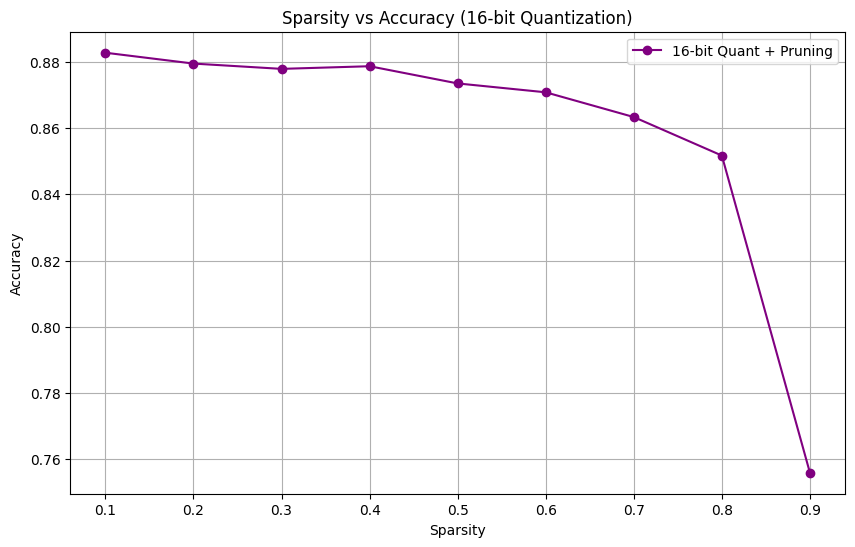
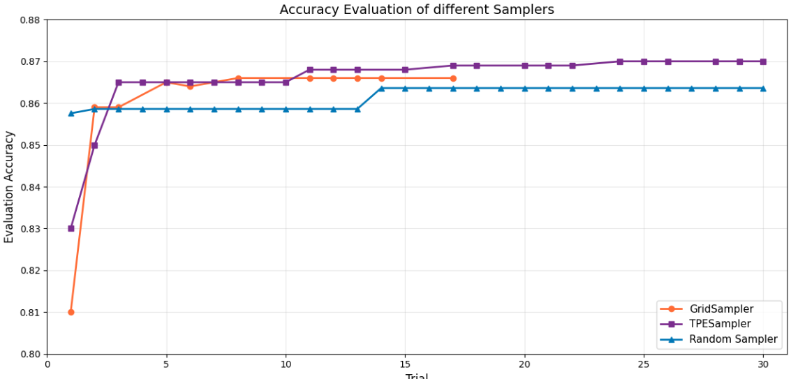
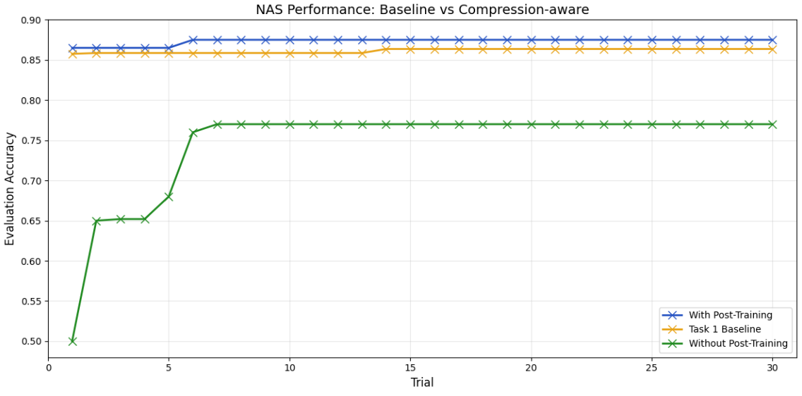

# Advanced Deep Learning Systems Report - Group 13
---

## Overview

This document summarises the work completed across all **ADLS labs**. 
The focus of the labs was on **model optimisation, hardware–software co-design, and deployment-aware deep learning**, using the MASE toolchain.

---

## Lab 0 - Introduction to MASE

## Tutorial 1

This tutorial introduces the Mase framework, explaining how it imports, represents, and transforms neural network models for hardware and software optimisation.

### Notes


#### 1. Importing Models

- Demonstrates how to import standard PyTorch models (BERT from HuggingFace) into the Mase environment.
- Mase uses Torch FX to "trace" the PyTorch code and capture a compute graph, converting Python code into a structured graph of nodes.

#### 2. MaseGraph (The Intermediate Representation)

- MaseGraph is the central data structure, acting as a wrapper around the Torch FX graph.
- Node Types: The graph consists of six atomic node types: placeholder (inputs), call_module (layers like Linear/Conv), call_function (torch ops like torch.add), call_method, get_attr (params), and output.
- Mase Operators: Mase adds an abstraction layer over raw PyTorch ops (e.g., module_related_func, builtin_func) to help unify software and hardware definitions.

#### 3. The Pass System

- Mase relies on a compiler-style "pass" system to optimise graphs.
- Analysis Passes: Read-only operations that annotate the graph with data (e.g., calculating tensor shapes, inferring data types).
- Transform Passes: Operations that modify the graph topology (e.g., deleting layers or inserting logic).
- Standard Interface: Every pass follows the signature: pass(mg, args) -> (mg, outputs).

#### 4. Practical Examples

- Metadata Initialisation: Using dummy inputs to propagate shapes through the network (init_metadata_analysis_pass, add_common_metadata_analysis_pass).
- Custom Analysis: Writing a simple function to count the number of Dropout layers.
- Custom Transformation: Writing a function to remove Dropout layers for inference optimisation.
Exporting & Checkpointing

The tutorial concludes by showing how to save the transformed graph to disk (mg.export()) and reload it later (MaseGraph.from_checkpoint()).


## Tutorial 2

This tutorial uses a pre-trained BERT model for sentiment analysis on the IMDb dataset, comparing standard Supervised Fine-Tuning (SFT) against the LoRA (Low-Rank Adaptation) technique.

### Notes

#### 1. Task Setup

- Goal: Classify movie reviews as positive or negative using the IMDb dataset.
- Model: A "tiny" variant of BERT is loaded from HuggingFace.
- A classification head (Linear Layer + Cross Entropy Loss) is attached to the pre-trained encoder.

#### 2. Customising the Compute Graph

- Demonstrates how MaseGraph can be customised to include specific inputs like labels (which triggers loss calculation) and `attention_mask`.
- By removing unused inputs (defaults like `token_type_ids`), the graph can be simplified.

#### 3. Supervised Fine-Tuning (SFT)

- Training Strategy: We freeze the largest part of the model (Embeddings) and train all other weights (Encoder layers + Classifier head).
- Cost: While effective, SFT requires updating a large number of parameters (order of millions), consuming significant memory.

#### 4. Parameter Efficient Fine-Tuning (PEFT) with LoRA
- Concept: Instead of updating the massive weight matrix *W*, LoRA updates two smaller low-rank matrices *A* and *B*, such that *W*<sub>new</sub> = *W*<sub>fixed</sub> + *A* × *B*.
- Mase Implementation Using `insert_lora_adapter_transform_pass`, the standard Linear layers are automatically swapped for LoRA layers.
- Benefit: Reduces trainable parameters significantly (~4.5× reduction), speeding up training and reducing memory usage.

#### 5. Optimising for Inference*
- Fusion: After training, the `fuse_lora_weights_transform_pass` permanently merges the learned *A* × *B* update into the original weights *W*.
- Result: The model returns to its original architecture (*Y* = *XW*<sub>fused</sub> + *b*), ensuring inference is just as fast as the original model with no extra computational overhead.

---

## Lab 1 - Model Compression with quantisation and Pruning

### General Introduction

In this lab, we compress a BERT model using **quantisation** and **pruning** techniques. We apply fixed-point quantisation and structured parameter removal to reduce model size and computational cost.

After compression, fine-tuning is performed to recover any performance degradation introduced by quantisation or pruning.

---

### Learning Tasks

1. Review **Tutorial 3 — Running quantisation-Aware Training (QAT) on BERT** to understand how to quantise a BERT model and perform post-quantisation fine-tuning.
2. Review **Tutorial 4 — Unstructured Pruning on BERT** to learn how to prune a quantised model for further compression.

---

### Implementation Tasks

#### Task 1 - Exploring Fixed-Point quantisation Precision

In Tutorial 3, every Linear layer in the model is quantised using a fixed configuration. In this task, we extend this analysis by exploring a range of fixed-point precisions.

##### Task 1a - Accuracy vs Fixed-Point Width

- A range of fixed-point widths from **4 to 32 bits** is evaluated.
- A figure is plotted where:
  - **x-axis:** Fixed-point width  
  - **y-axis:** Highest achieved accuracy on the IMDb dataset  


##### Task 1b - PTQ vs QAT Comparison

- Separate curves are plotted for:
  - **Post-Training quantisation (PTQ)**
  - **quantisation-Aware Training (QAT)**
- This comparison highlights the effect of post-quantisation fine-tuning at each precision level.


---

#### Task 2 - Pruning the Best quantised Model

Using the best-performing model obtained from Task 1 which seemed to be ~16 bits. We apply pruning to further reduce model complexity.

##### Task 2a - Accuracy vs Sparsity

- Sparsity levels are varied from **0.1 to 0.9**.
- A figure is plotted where:
  - **x-axis:** Sparsity  
  - **y-axis:** Highest achieved accuracy on the IMDb dataset  
- The pruning procedure follows the workflow described in Tutorial 4.



##### Task 2b - Pruning Strategy Comparison

- Separate curves are plotted for:
  - **Random pruning**
  - **L1-Norm pruning**
- This comparison evaluates the impact of different pruning strategies on model accuracy.


Although separate curves can be plotted, putting them on one plot allows a sharper comparison between performances. 

---

### Observations
- L1-norm pruning dominates random pruning across all sparsity levels
- Random pruning is highly unstable beyond moderate sparsity
- Magnitude-aware pruning enables higher compression without major accuracy loss
- Extremely high sparsity remains challenging even with complex pruning strategies

### Key Takeaway
- The experiments demonstrate that fine-tuning is mandatory for effective model compression, as naive approaches like Post-Training quantisation cause performance to collapse at lower bit-widths. However, by retraining the model to adapt to constraints, BERT proves highly robust, recovering near-original accuracy even when combining 16-bit precision with high sparsity (up to ~55%). 

---

## Lab 2 - Neural Architecture Search (NAS)

### Objectives
- Explore automated architecture optimisation using Optuna samplers within Mase 
- Define, evaluate and compare search spaces and strategies for Bert

### **Work Completed**

### Task 1 - Comparing Hyperparameter Samplers

Tutorial 5 initially demonstrates the use of random search to find an optimal configuration of hyperparameters and layer choices for the BERT model for the IMDb classification task. We extend this by evaluating three Optuna samplers.

#### Samplers Evaluated
- **RandomSampler**: Each trial iteration pulls hyperparameter values from the search space uniformly. Provides an unbiased baseline, however, trials are independent and can not infer information from other trials. A large number of trials are required to find a near-optimal test score accuracy solution.
- **GridSampler**: Performs a grid search over the entire search space.  Enumerates combinations of predetermined grid. This method ensures full coverage of space but scales poorly. A very large number of trials would be required to search for all possible hyperparamter combinations, for the 30 trials that we test for inis lab, we are unlikely to see any optimal results. Due to the large number of possible combinations we  have limited the grid to five main hyperparameters. 
- **TPESampler**: uses initial random exploration followed by two kernel density estimators: l(x) modeling the best-performing hyperparameter configurations and g(x) modeling the remaining configurations. By maximising the ratio l(x)/g(x), it guides the search toward regions of the hyperparameter space that are more likely to yield good performance.

Each sampler explores the same search space and optimisation objective, allowing a direct comparison of search efficiency and convergence behaviour.

To ensure a fair comparison, all samplers operated over the same search space:

| Parameter | Search Space |
|-----------|-------------|
| `num_hidden_layers` | {2, 4, 8} |
| `num_attention_heads` | {2, 4, 8, 16} |
| `hidden_size` | {128, 192, 256, 384, 512} |
| `intermediate_size` | {512, 768, 1024, 1536, 2048} |
| Linear layer type | {`nn.Linear`, `Identity`} (per eligible layer) |

Each trial trained a freshly initialised BERT model from the sampled configuration for 1 epochs on the IMDb training set. All experiments used 30 trials per sampler. We report the running maximum accuracy to capture convergence behaviour.


Each sampler is represented by a separate curve to compare performance over time. The tests were each run for 1 epochs for 30 trial runs, using the running maximal error. These results have been plotted below. 



#### Experimental Observations

- **Convergence of TPESampler**: TPESampler achieves the fastest convergence, reaching ~86.5% accuracy in 3 trials and steadily improving to ~87% by trial 30, demonstrating effective exploitation of early promising configurations.
- **GridSampler**: GridSampler starts lowest, ~81%, but improves to reach similar performance to TPESampler', ~86.6%.
- **RandomSampler**: RandomSampler plateaus early, ~86.4%, with minimal improvement across the 30 trials.
- **Similar Performances**: All 3 samplers converge to similar accuracies, 86.4-87%, suggesting the search space contains multiple near-optimal configurations for the model architecture. The key difference displayed in this experiment is the convergence speed, making TPESampler most suitable for the best model in Task 2, convergeing the fastest and achieving the strongest performance.

---

### Task 2 - Compression-Aware Neural Architecture Search

In Tutorial 5, NAS is first used to identify an optimal model configuration, after which the CompressionPipeline is applied to quantise and prune the model. However, this post-search compression may be suboptimal, as different architectures exhibit varying sensitivity to compression techniques.

To address this, we implement a compression-aware search in which quantisation and pruning are applied directly into each Optuna trial.

---

#### Task 2a - Compression-Aware Objective Function

Within the Optuna objective function:
1. The model is constructed according to the sampled hyperparameters.
2. The model is trained for an initial number of iterations.
3. The CompressionPipeline is invoked to apply quantisation and pruning.
4. Training continues for additional epochs after compression.
5. The objective function returns the final model accuracy after compression.

The sampler that yielded the best results in Task 1 (TPESampler) is reused for this experiment.

An additional variant is considered where final training is performed after quantisation/pruning, allowing further recovery of accuracy.

---

#### Task 2b - Performance Comparison

The figure includes three curves:
1. Best performance from Task 1 (no compression)
2. Compression-aware search without post-compression training
3. Compression-aware search with post-compression training




#### Observations
- Model without post-training plateaus at ~0.77. After training, quantisation and pruning are applied and the model is evaluated without any post-training. quantisation rounds all weights to 8-bit fixed point with only 4 fractional bits of precision, while L1 pruning zeros out the 50% smallest weights in each layer. The first few trials score very poorly at ~0.50.
- Model with post-training converges at ~0.87. The same compression is applied, but the model is then fine-tuned. This allows the weights to adjust and compensate for the pruning.
- Post trained model vs task 1 baseline: The compression-aware search favours architectures that are robust to quantisation and pruning. Additionally, removing 50% of weights acts as a form of regularisation. Removing some parameters reduces overfitting, which is why the compressed and fine-tuned model ends up generalising slightly better than the task 1 baseline.

---

## Lab 3 - Mixed Precision Optimisation

### Objectives
- Investigate mixed-precision inference
- Balance numerical precision and performance

### Work Completed

**Task 1:** Modified the Optuna search to allow per-layer quantisation hyperparameters for `LinearInteger`. Each layer can independently select width $\in \{8, 16, 32\}$ and fractional width $\in \{2, 4, 8\}$, exposing these as searchable hyperparameters via `trial.suggest_categorical()`.

**Task 2:** Extended the search space to include all supported quantised layer types: `LinearInteger`, `LinearMinifloatIEEE`, `LinearBlockFP`, `LinearBlockLog`, `LinearLog`, and `LinearBinary` (`LinearBlockMinifloat` was not tested due to an issue in Mase). Each layer type required specific configuration parameters (exponent widths, block sizes, etc.) to be passed correctly.

We then ran 50 trials using Optuna's `RandomSampler` on `BERT-tiny` for IMDb sentiment classification.


### Observations

- All quantisation methods except Binary converge to ~85% accuracy, matching full-precision FP32 performance.
- `LinearBinary` (1-bit) starts poorly (~64%) but reaches 82.9% with the right configuration, only 2.6% below baseline while achieving **32x compression**.
- `LinearLog` slightly outperformed other quantised formats, achieving both the highest peak (85.8%) and mean accuracy (83.6%). This suggests logarithmic representation better captures the weight distribution of transformer models, which typically have many small values with some larger outliers.
- The best overall model (85.79%) used **mixed precision**, combining different layer types: LinearLog for feed-forward layers, LinearBinary for less-sensitive attention outputs, and FP32 for critical attention projections.

### Key Takeaway
Moderate quantisation (8-16 bit) provides essentially free compression with negligible accuracy loss. For aggressive compression, binary quantisation offers a compelling trade-off: 32x smaller models with only ~3% accuracy drop, ideal for edge & IoT deployment where memory and compute are constrained. Mixed-precision search reveals that different layers have different quantisation sensitivities, and the optimal configuration uses the right precision for each layer rather than a uniform approach.

---

## Lab 4 — Hardware & Software Co-Design

### Hardware Stream

#### Objectives
- Emit hardware-oriented representations
- Prepare models for acceleration

### Work Completed

### Observations

### Key Takeaway


## Hardware metadata pass

The MASE hardware metadata pass populates the hardware {} metadata of a module with information needed to generate the the module instances of Verilog modules.

The hardware metadata includes:
- SystemVerilog dependency files needed to generate the module
- Parameters needed to instantiate the module
- Tool-chain used to create the module hardware e.g. (INTERNAL, EXTERNAL, HLS)
- Device_id to which the hardware the node is mapped to 
- Interface which the node receives weights from

The hardware metadata differs from the software metadata in that ...

## MASE "top.sv" Emitted Hardware

In the lab, we build an MLP (Multi Layer Perceptron) with one linear layer (4 input features, 8 output features)

The top level file instantiates
- **Fixed point linear layer** module, which performs the  $y = x A^T + b$  calculation
- **Weights and biases sources** which are BRAM stores off the values needed for the linear layer
- **Fixed ReLU** module to perform the rectified linear function
```verilog
fixed_linear #( ...

fc1_weight_source #( ...

fc1_bias_source #( ...

fixed_relu #( ...
```

Each module has an data and ready in/out to synchronise data transfers between the layers


*Figure 1: MLP MASE graph, sourced from mg.draw()


## Simulation Results

The *simulate()* call runs a cocotb test which hooks to a Verilated model of the top level. 


*Figure 2: Results of cocotb simulation*

### Generating Wave forms (MASE bug)

There is a bug in the MASE "simulate()" function that doesn't allow you to output waveform files.

In the file *src/chop/actions/simulate.py*, the runner never takes in the waves parameter, hence never generates waves


*Figure 3: BugFix for waves bug*

Once this fix was implemented, we ran the simulation and opened the *dump.fst* file.


*Figure 4: ReLU Waveform*

## Implementing RReLU

The randomised leaky rectified linear unit [RReLU](https://www.google.com) in PyTorch implements the function below, where a is a randomised fixed point number within a range specified by inputs.
$$
\mathrm{RReLU}(x) =
\begin{cases}
x, & \text{if } x \ge 0 \\
a x, & \text{otherwise}
\end{cases}
$$To implement this in hardware, for the purpose of experimentation, we created a version with the following architecture 

### Design 

An LFSR generates random 32 bit integers.
``` systemverilog
module lfsr32 #(
    parameter logic [31:0] RAND_SEED = 32'hA69420B1
) (
    input  logic        clk,
    input  logic        rst,
    output logic [31:0] o_dout
);
  logic [31:0] sreg;
  always_ff @(posedge clk) begin
    if (rst) begin
      sreg <= RAND_SEED;
    end else begin
      sreg <= {sreg[30:0], (sreg[0] ^ sreg[1] ^ sreg[21] ^ sreg[31])};
    end
  end
  assign o_dout = sreg;
endmodule
```

The module takes in a lower and upper fixed point value and uses the LFSR random number to get a number within that range.
```systemverilog
localparam logic [DATA_IN_0_PRECISION_0-1:0] UPPER = 7;  // 0.875
localparam logic [DATA_IN_0_PRECISION_0-1:0] LOWER = 1;  // 0.125
localparam logic [DATA_IN_0_PRECISION_0-1:0] RANGE = UPPER - LOWER;
localparam logic [31:0] RAND_SEED = 32'hA69420B1;

logic [31:0] random;
logic [63:0] rand_scaled;
logic [DATA_IN_0_PRECISION_0-1:0] rand_fixed;
logic signed [DATA_IN_0_PRECISION_0-1:0] rand_fixed_s;

always_comb begin
  rand_scaled = random * RANGE;
  rand_fixed = LOWER + (rand_scaled >> 32);
end
```

The output is scaled by the random number if the input is negative, as specified in the RReLU PyTorch documentation.

```systemverilog
logic signed[2*DATA_IN_0_PRECISION_0-1:0] mult_tmp;
always_ff @(posedge clk) begin
  if (rst) begin
    data_out_0[i] <= 0;
  end else begin
    if ($signed(data_in_0[i]) <= 0) begin
      mult_tmp = rand_fixed_s * $signed(data_in_0[i]);
      data_out_0[i] <= mult_tmp >>> DATA_IN_0_PRECISION_1;
    end else begin
      data_out_0[i] <= data_in_0[i];
    end
  end
end
```

A one cycle delay is added to the valid and ready signals to account for the latency.

```systemverilog
always_ff @(posedge clk) begin
    if (rst) begin
        data_out_0_valid <= 0;
        data_in_0_ready  <= 0;
    end else begin
        data_out_0_valid <= data_in_0_valid;
        data_in_0_ready  <= data_out_0_ready;
    end
end
```

### Assumptions and Limitations
Assumptions:
- Inputs DATA_IN_0_PRECISION_0 are 32 bits or less.
- Hardware can handle multiple multiplications in one cycle 
Limitations:
- Distribution is not perfectly uniform.
- Multiplication rounding is not uniform
### Simulation Results

#### Accuracy

In this experiment. We added an output layer to the MLP and fed generated 4D linearly separable data to a model with ReLU and one with RReLU. Results showed the RReLU in PyTorch is greatly beneficial for the speed of convergence of MLPs.


*Figure 5: ReLU vs RReLU PyTorch Performance Comparison*

#### Waves


Running the simulation again shows the randomly generated "rand_fixed_s" coefficients which lie within the range specified.


*Figure 6: RReLU hardware waveform*

#### Latency

The simulation latency increases to 300ns from 280ns due to the added cycle of delay.


*Figure 7: RReLU simulation log*


