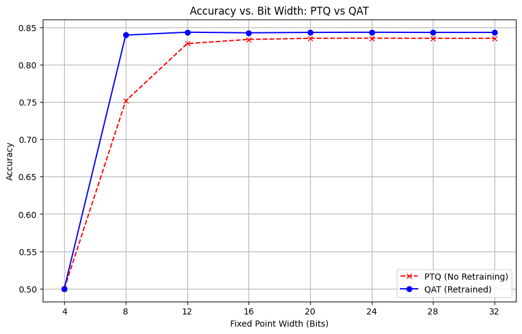
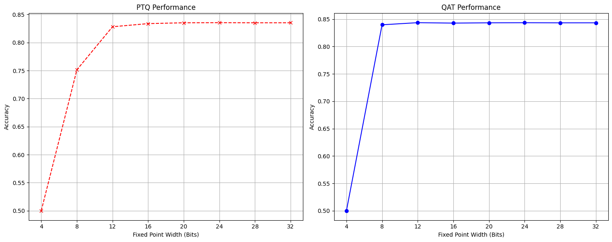
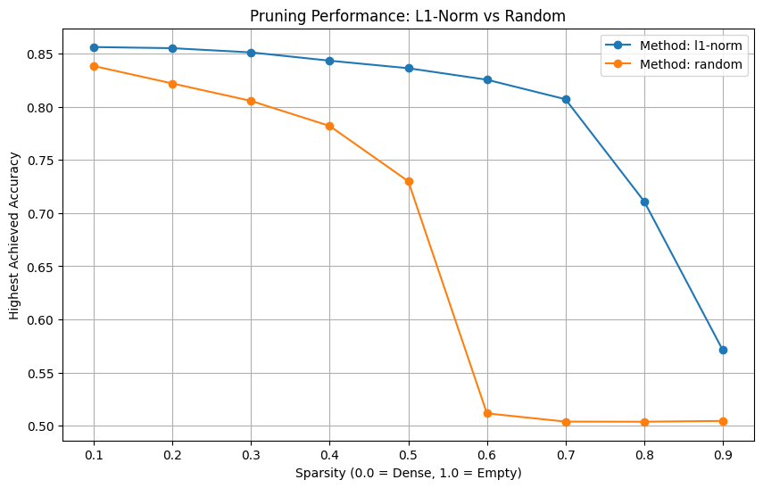
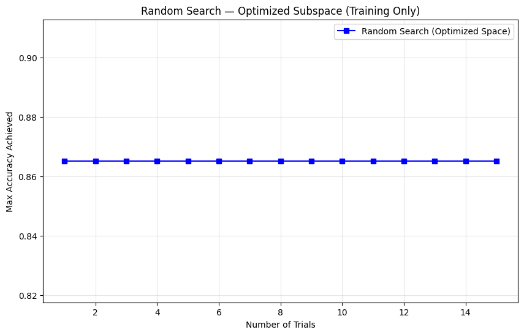
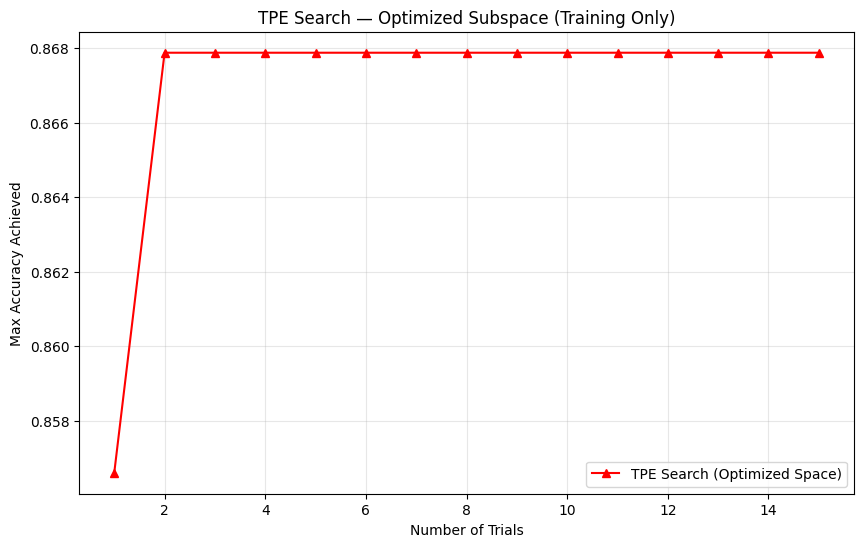
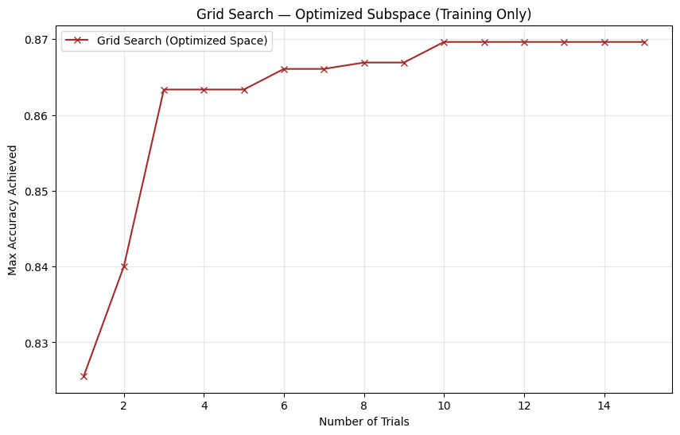
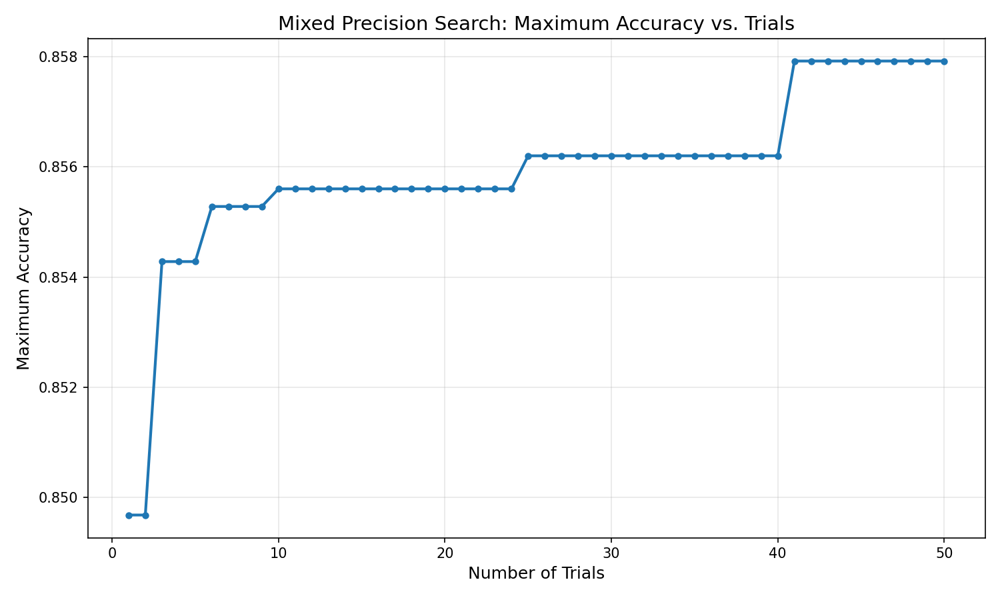
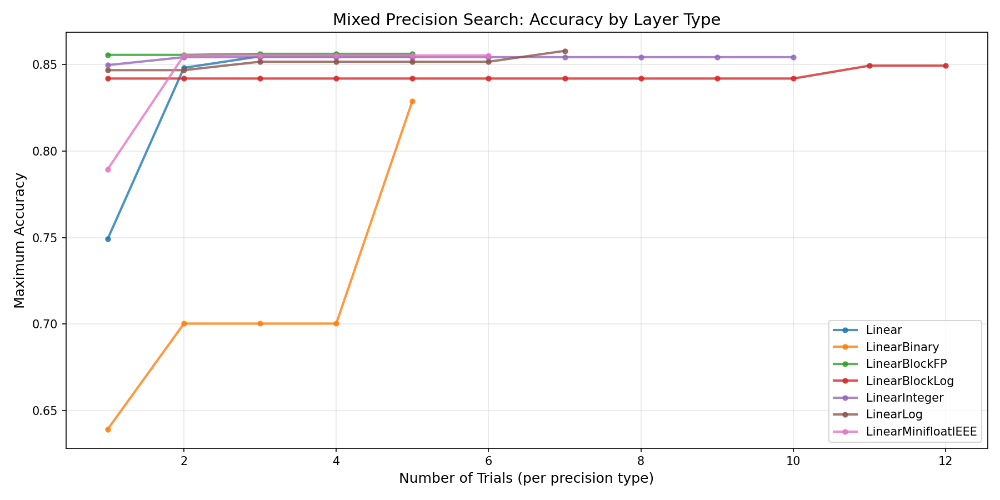

# Advanced Deep Learning Systems Report - Group 13
---

## Overview

This document summarises the work completed across all **ADLS labs and tutorials**, following the official MASE / ADLS workflow.  
The focus of the labs was on **model optimisation, hardware–software co-design, and deployment-aware deep learning**, using the MASE toolchain.

---

## Lab 0 — Introduction to MASE

## Tutorial 1

This tutorial introduces the Mase framework, explaining how it imports, represents, and transforms neural network models for hardware and software optimisation.

### Key Concepts


#### 1. Importing Models

- Demonstrates how to import standard PyTorch models (BERT from HuggingFace) into the Mase environment.
- Mase uses Torch FX to "trace" the PyTorch code and capture a compute graph, converting Python code into a structured graph of nodes.

#### 2. MaseGraph (The Intermediate Representation)

- MaseGraph is the central data structure, acting as a wrapper around the Torch FX graph.
- Node Types: The graph consists of six atomic node types: placeholder (inputs), call_module (layers like Linear/Conv), call_function (torch ops like torch.add), call_method, get_attr (params), and output.
- Mase Operators: Mase adds an abstraction layer over raw PyTorch ops (e.g., module_related_func, builtin_func) to help unify software and hardware definitions.

#### 3. The Pass System

- Mase relies on a compiler-style "pass" system to optimise graphs.
- Analysis Passes: Read-only operations that annotate the graph with data (e.g., calculating tensor shapes, inferring data types).
- Transform Passes: Operations that modify the graph topology (e.g., deleting layers or inserting logic).
- Standard Interface: Every pass follows the signature: pass(mg, args) -> (mg, outputs).

#### 4. Practical Examples

- Metadata Initialisation: Using dummy inputs to propagate shapes through the network (init_metadata_analysis_pass, add_common_metadata_analysis_pass).
- Custom Analysis: Writing a simple function to count the number of Dropout layers.
- Custom Transformation: Writing a function to remove Dropout layers for inference optimisation.
Exporting & Checkpointing

The tutorial concludes by showing how to save the transformed graph to disk (mg.export()) and reload it later (MaseGraph.from_checkpoint()).


Qna Questions:

- Why Torch FX? Mase chooses FX over ONNX or TorchScript because it is Python-native. It allows graph transformations using pure Python code without needing a C++ runtime or complex external standard.
- The Necessity of Dummy Inputs: In the "Shape Propagation" step, Mase requires a real dummy input tensor to run a forward pass. This is how it determines specific tensor sizes (H, W, Channels) at every node in the graph.
- Graph Integrity: When writing a Transform Pass to remove a node (like Dropout), you cannot just delete it. You must use node.replace_all_uses_with(parent_node) first. If you delete a node that is still being used as an input by another node, the graph becomes invalid and will crash.
- Where is the data stored? All Mase-specific information (quantisation bits, hardware settings, shapes) is stored in a hidden dictionary on each node: node.meta["mase"].

## Tutorial 2

This tutorial uses a pre-trained BERT model for sentiment analysis on the IMDb dataset, comparing standard Supervised Fine-Tuning (SFT) against the LoRA (Low-Rank Adaptation) technique.

### Key Concepts

#### 1. Task Setup

- Goal: Classify movie reviews as positive or negative using the IMDb dataset.
- Model: A "tiny" variant of BERT is loaded from HuggingFace.
- Architecture Adjustment: A classification head (Linear Layer + Cross Entropy Loss) is attached to the pre-trained encoder.

#### 2. Customising the Compute Graph

- Demonstrates how MaseGraph can be customised to include specific inputs like labels (which triggers loss calculation) and `attention_mask`.
- By removing unused inputs (defaults like `token_type_ids`), the graph can be simplified.

#### 3. Supervised Fine-Tuning (SFT)

- Training Strategy: We freeze the largest part of the model (Embeddings) and train all other weights (Encoder layers + Classifier head).
- Cost: While effective, SFT requires updating a large number of parameters (order of millions), consuming significant memory.

#### 4. Parameter Efficient Fine-Tuning (PEFT) with LoRA
- Concept: Instead of updating the massive weight matrix *W*, LoRA updates two tiny low-rank matrices *A* and *B*, such that  
  *W*<sub>new</sub> = *W*<sub>fixed</sub> + *A* × *B*.
- Mase Implementation Using `insert_lora_adapter_transform_pass`, the standard Linear layers are automatically swapped for LoRA layers.
- Benefit: Reduces trainable parameters significantly (approx. **4.5× reduction** in this example), speeding up training and reducing memory usage with comparable accuracy.

#### 5. Optimising for Inference*
- Fusion: After training, the `fuse_lora_weights_transform_pass` permanently merges the learned *A* × *B* update into the original weights *W*.
- Result: The model returns to its original architecture (*Y* = *XW*<sub>fused</sub> + *b*), ensuring inference is just as fast as the original model with no extra computational overhead.


#### Important Details for Q&A
- Why freeze embeddings? In NLP models, the embedding layer often contains the vast majority of parameters but requires little adjustment for downstream tasks. Freezing it drastically saves resources.
- LoRA Trade-off: The "rank" (r) parameter controls the balance. Higher rank = more capacity to learn (higher accuracy) but more memory. Lower rank = extreme efficiency.
- Inference Speed: A LoRA model during training is slower (extra matrix multiplications). A LoRA model after fusion is identical in speed to the original base model.
- Mase Pass: The fuse_lora_weights_transform_pass is crucial for deployment; without it, you are running extra operations for no reason.
---

## Lab 1 — Model Compression with Quantization and Pruning

### General Introduction

In this lab, we explore how to use **MASE** to compress a BERT model using **quantization** and **pruning** techniques. We apply fixed-point quantization and structured parameter removal to reduce model size and computational cost.

After each compression stage, additional fine-tuning is performed to recover any performance degradation introduced by quantization or pruning.

---

### Learning Tasks

1. Review **Tutorial 3 — Running Quantization-Aware Training (QAT) on BERT** to understand how to quantize a BERT model and perform post-quantization fine-tuning.
2. Review **Tutorial 4 — Unstructured Pruning on BERT** to learn how to prune a quantized model for further compression.

---

### Implementation Tasks

#### Task 1 — Exploring Fixed-Point Quantization Precision

In Tutorial 3, every Linear layer in the model is quantized using a fixed configuration. In this task, we extend this analysis by exploring a wider range of fixed-point precisions.

##### Task 1a — Accuracy vs Fixed-Point Width

- A range of fixed-point widths from **4 to 32 bits** is evaluated.
- A figure is plotted where:
  - **x-axis:** Fixed-point width  
  - **y-axis:** Highest achieved accuracy on the IMDb dataset  
- The procedure follows the workflow outlined in Tutorial 3.



##### Task 1b — PTQ vs QAT Comparison

- Separate curves are plotted for:
  - **Post-Training Quantization (PTQ)**
  - **Quantization-Aware Training (QAT)**
- This comparison highlights the effect of post-quantization fine-tuning at each precision level.



---

#### Task 2 — Pruning the Best Quantized Model

Using the best-performing model obtained from Task 1, we apply pruning to further reduce model complexity.

##### Task 2a — Accuracy vs Sparsity

- Sparsity levels are varied from **0.1 to 0.9**.
- A figure is plotted where:
  - **x-axis:** Sparsity  
  - **y-axis:** Highest achieved accuracy on the IMDb dataset  
- The pruning procedure follows the workflow described in Tutorial 4.


##### Task 2b — Pruning Strategy Comparison

- Separate curves are plotted for:
  - **Random pruning**
  - **L1-Norm pruning**
- This comparison evaluates the impact of different pruning strategies on model accuracy.



---

### Observations
- *(To be filled in)*

### Key Takeaway
- *(To be filled in)*

---

## Lab 1 — Model Compression

### Objectives
- Apply compression techniques to reduce model size
- Evaluate accuracy–efficiency trade-offs

### Work Completed

### Observations

### Key Takeaway

---

## Lab 2 — Neural Architecture Search (NAS)

### Objectives
- Explore automated architecture optimisation
- Define and evaluate search spaces

### **Work Completed**

### Task 1 — Comparing Hyperparameter Samplers

Tutorial 5 initially demonstrates the use of **random search** to find an optimal configuration of hyperparameters and layer choices for the BERT model. We extend this analysis by evaluating additional Optuna samplers.

#### Samplers Evaluated
- **RandomSampler**
- **GridSampler**
- **TPESampler**

Each sampler explores the same search space and optimisation objective, allowing a direct comparison of search efficiency and convergence behaviour.

- **Search Space:** To accurately compare the performance of each sampler, a fixed and confined search space was required, particularly for the GridSampler. Due to the exhaustive nature of grid search and its poor scalability in high-dimensional spaces, we used the **TPESampler** to first identify a promising subspace. This confined search space was then used consistently across all samplers to ensure a fair comparison.

Each sampler is represented by a separate curve to compare performance over time.





#### Observations
- The **TPESampler** consistently achieves higher accuracy with fewer trials compared to both RandomSampler and GridSampler.
- This is because TPE is a **model-based Bayesian optimisation method** that builds probabilistic models of good and bad hyperparameter configurations, allowing it to focus future samples on the most promising regions of the search space.
- Unlike GridSampler, TPE **does not suffer from the curse of dimensionality**, as it does not exhaustively evaluate every possible combination.
- Compared to RandomSampler, TPE is more **sample-efficient**, as each new trial is informed by the results of previous trials rather than being drawn independently.
- TPE also handles **mixed and conditional hyperparameters** effectively, making it well-suited for complex neural architectures such as BERT.
- As a result, TPE converges faster and achieves better performance within a limited trial budget.

---

### Task 2 — Compression-Aware Neural Architecture Search

In Tutorial 5, NAS is first used to identify an optimal model configuration, after which the **CompressionPipeline** is applied to quantize and prune the model. However, this post-search compression may be suboptimal, as different architectures exhibit varying sensitivity to compression techniques.

To address this, we implement a **compression-aware search**, where quantization and pruning are incorporated directly into each Optuna trial.

---

#### Task 2a — Compression-Aware Objective Function

Within the Optuna objective function:
1. The model is constructed according to the sampled hyperparameters.
2. The model is trained for an initial number of iterations.
3. The **CompressionPipeline** is invoked to apply quantization and pruning.
4. Training continues for additional epochs after compression.
5. The objective function returns the **final model accuracy after compression**.

The sampler that yielded the best results in **Task 1** is reused for this experiment.

An additional variant is considered where **final training is performed after quantization/pruning**, allowing further recovery of accuracy.

---

#### Task 2b — Performance Comparison

A new figure is plotted with:
- **x-axis:** Number of completed trials  
- **y-axis:** Maximum achieved accuracy up to that trial  

The figure includes three curves:
1. Best performance from **Task 1** (no compression)
2. Compression-aware search **without** post-compression training
3. Compression-aware search **with** post-compression training


---

#### Observations
- *(To be filled in)*

#### Key Takeaway
- *(To be filled in)*


### Observations

### Key Takeaway
---

## Lab 3 — Mixed Precision Optimisation

### Objectives
- Investigate mixed-precision inference
- Balance numerical precision and performance

### Work Completed

**Task 1:** Modified the Optuna search to allow per-layer quantisation hyperparameters for `LinearInteger`. Each layer can independently select width $\in \{8, 16, 32\}$ and fractional width $\in \{2, 4, 8\}$, exposing these as searchable hyperparameters via `trial.suggest_categorical()`.

**Task 2:** Extended the search space to include all supported quantised layer types: `LinearInteger`, `LinearMinifloatIEEE`, `LinearBlockFP`, `LinearBlockLog`, `LinearLog`, and `LinearBinary` (`LinearBlockMinifloat` was not tested due to an issue in Mase). Each layer type required specific configuration parameters (exponent widths, block sizes, etc.) to be passed correctly.

We then ran 50 trials using Optuna's `RandomSampler` on `BERT-tiny` for IMDb sentiment classification.





### Observations

- All quantisation methods except Binary converge to ~85% accuracy, matching full-precision FP32 performance.
- `LinearBinary` (1-bit) starts poorly (~64%) but reaches 82.9% with the right configuration, only 2.6% below baseline while achieving **32x compression**.
- `LinearLog` slightly outperformed other quantised formats, achieving both the highest peak (85.8%) and mean accuracy (83.6%). This suggests logarithmic representation better captures the weight distribution of transformer models, which typically have many small values with some larger outliers.
- The best overall model (85.79%) used **mixed precision**, combining different layer types: LinearLog for feed-forward layers, LinearBinary for less-sensitive attention outputs, and FP32 for critical attention projections.

### Key Takeaway
Moderate quantisation (8-16 bit) provides essentially free compression with negligible accuracy loss. For aggressive compression, binary quantisation offers a compelling trade-off: 32x smaller models with only ~3% accuracy drop, ideal for edge & IoT deployment where memory and compute are constrained. Mixed-precision search reveals that different layers have different quantisation sensitivities, and the optimal configuration uses the right precision for each layer rather than a uniform approach.

---

## Lab 4 — Hardware & Software Co-Design

### Hardware Stream

#### Objectives
- Emit hardware-oriented representations
- Prepare models for acceleration

### Work Completed

### Observations

### Key Takeaway


## Hardware metadata pass

The MASE hardware metadata pass populates the hardware {} metadata of a module with information needed to generate the the module instances of Verilog modules.

The hardware metadata includes:
- SystemVerilog dependency files needed to generate the module
- Parameters needed to instantiate the module
- Tool-chain used to create the module hardware e.g. (INTERNAL, EXTERNAL, HLS)
- Device_id to which the hardware the node is mapped to 
- Interface which the node receives weights from

The hardware metadata differs from the software metadata in that ...

## MASE "top.sv" Emitted Hardware

In the lab, we build an MLP (Multi Layer Perceptron) with one linear layer (4 input features, 8 output features)

The top level file instantiates
- **Fixed point linear layer** module, which performs the  $y = x A^T + b$  calculation
- **Weights and biases sources** which are BRAM stores off the values needed for the linear layer
- **Fixed ReLU** module to perform the rectified linear function
```verilog
fixed_linear #( ...

fc1_weight_source #( ...

fc1_bias_source #( ...

fixed_relu #( ...
```

Each module has an data and ready in/out to synchronise data transfers between the layers


*Figure 1: MLP MASE graph, sourced from mg.draw()


## Simulation Results

The *simulate()* call runs a cocotb test which hooks to a Verilated model of the top level. 


*Figure 2: Results of cocotb simulation*


## Implementing RReLU

The randomised leaky rectified linear unit [RReLU](https://www.google.com) in PyTorch implements the function below, where a is a randomised fixed point number within a range specified by inputs.
$$
\mathrm{RReLU}(x) =
\begin{cases}
x, & \text{if } x \ge 0 \\
a x, & \text{otherwise}
\end{cases}
$$To implement this in hardware, for the purpose of experimentation, we created a version with the following architecture 

### Design 

An LFSR generates random integers.
``` systemverilog
module lfsr32 #(
    parameter logic [31:0] RAND_SEED = 32'hA69420B1
) (
    input  logic        clk,
    input  logic        rst,
    output logic [31:0] o_dout
);
    logic [31:0] sreg;

    always_ff @(posedge clk) begin
        if (rst) begin
            sreg <= 32'b1;
        end else begin
            sreg <= {sreg[30:0], (sreg[0] ^ sreg[1] ^ sreg[21] ^ sreg[31])};
        end
    end

    assign o_dout = sreg;
endmodule
```

The module takes in a lower and upper fixed point value and uses the LFSR random number to get a number within that range.
```systemverilog
localparam [DATA_IN_0_PRECISION_0-1:0] LOWER = 7; // 0.875
localparam [DATA_IN_0_PRECISION_0-1:0] UPPER = 1; // 0.125
localparam RANGE = UPPER - LOWER;
logic [DATA_IN_0_PRECISION_0:0] random;
logic [64:0] ran_scaled;

assign ran_scaled = LOWER + (random * RANGE) >> DATA_IN_0_PRECISION_0;
```

The output is scaled by the random number if the input is negative, as specified in the RReLU PyTorch documentation.

```systemverilog
always_ff @(posedge clk) begin
    if (rst) begin
        data_out_0[i] <= 0;
    end else begin
        if ($signed(data_in_0[i]) <= 0) begin
            data_out_0[i] <= '0;
        end else begin
            data_out_0[i] <= ran_scaled * data_in_0[i];
        end
    end
end
```

A one cycle delay is added to the valid and ready signals to account for the latency.

```systemverilog
always_ff @(posedge clk) begin
    if (rst) begin
        data_out_0_valid <= 0;
        data_in_0_ready  <= 0;
    end else begin
        data_out_0_valid <= data_in_0_valid;
        data_in_0_ready  <= data_out_0_ready;
    end
end
```

### Assumptions and Limitations
The implementation assumes 
- Inputs DATA_IN_0_PRECISION_0 are 32 bits or less.

Limitations include
- Distribution is not perfectly uniform.
---


